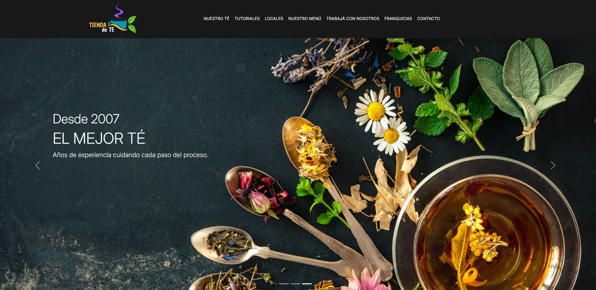
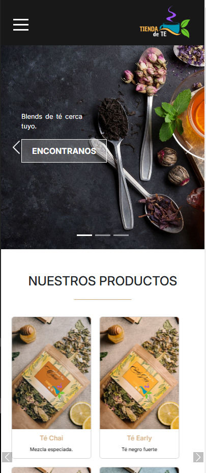

# Tienda de Té - Sitio Web

Este repositorio contiene el código para el sitio web de "Tienda de Té", que ofrece información sobre productos, franquicias, tutoriales y contacto, junto con diversas funcionalidades implementadas en HTML, CSS y JavaScript.

## Capturas de Pantalla

### Página Principal pantallas grandes

### Página Principal pantallas pequeñas

## Estructura del Proyecto

### Carpetas
- **css**: Contiene los archivos CSS para el estilo del sitio, asegurando un diseño consistente y responsive.
- **img**: Contiene las imágenes usadas en el sitio, incluyendo las imágenes de productos y de fondo.
- **js**: Incluye los scripts de JavaScript necesarios para agregar interactividad y funcionalidad adicional.

### Archivos HTML
- **index.html**: Página principal del sitio, con una introducción a la tienda y enlaces a otras secciones.
- **contacto.html**: Página de contacto, incluye un formulario para que los usuarios puedan comunicarse con la tienda.
- **franquicias.html**: Página con información sobre cómo convertirse en franquiciado de la tienda, con un formulario para registrarse.
- **locales.html**: Muestra la ubicación de los locales en un mapa de Google Maps embebido.
- **menu-tienda.html**: Página con el menú de productos, incluyendo tés, alfajores y tortas, diseñado para ser responsivo y fácil de navegar.
- **tienda.html**: Página de productos exclusivos con imágenes y descripciones de cada té.
- **trabajar-en-tdt.html**: Sección para aquellos interesados en trabajar en la tienda, con formulario para dejar el cv.
- **tutoriales.html**: Página que ofrece tutoriales, sobre mezclas de té y consejos de preparación.

### Principales Funcionalidades
- **Responsividad**: El sitio utiliza media queries y puntos de ruptura específicos (1080px, 768px, 480px y 375px) para adaptarse a diferentes tamaños de pantalla.
- **Carrusel de Productos**: Muestra imágenes y descripciones de productos exclusivos en una sola fila, con controles personalizados fuera del contenedor.
- **Menú de Productos**: El menú es responsivo y presenta una sección de fondo de imagen que resalta las opciones de té, alfajores, tortas, y sándwiches.
- **Botones Personalizados**: Botones como `btn btn-primary` de Bootstrap se usan para mejorar la interacción.
- **Formulario de Contacto**: Un formulario HTML para que los visitantes puedan enviar consultas o comentarios.
- **Interactividad**: Uso de efectos hover, superposición de texto sobre imágenes y botones transparentes con transiciones para mejorar la experiencia del usuario.
- **Footer y Header**: El diseño responsive del footer incluye íconos y textos adaptados al ancho de pantalla. El header contiene un logo y menú hamburguesa para pantallas pequeñas.

### Autores

Este sitio fue desarrollado por **Grupo Seen** //Emiliano Celleri, Joana Coll, Ana Sol Nuñez, María Eugenia Descalzo// utilizando HTML, CSS y JavaScript con un enfoque en diseño responsive y una experiencia de usuario enriquecida.
